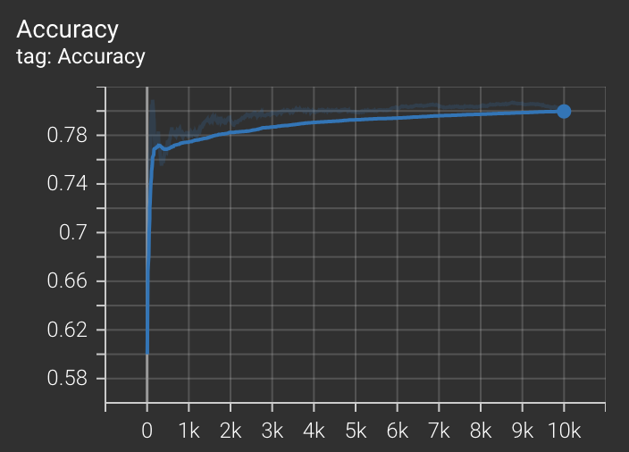

# VQA
Zero shot Visual Question Answering

I used Grounding Dino + SAM for zero shot visual question answering.

This is my result. This test dataset is cifar100 and I used 10,000 images for checking accuracy (80.2%). 


To run my code,

``` cmd
cd vqa
mkdir img
cd img
mkdir result
mkdir src
```

Input the source image into the vqa/img/src.
Before run my main_vqa.py code, please install 
``` cmd
python3 -m spacy download en_core_web_sm
```

